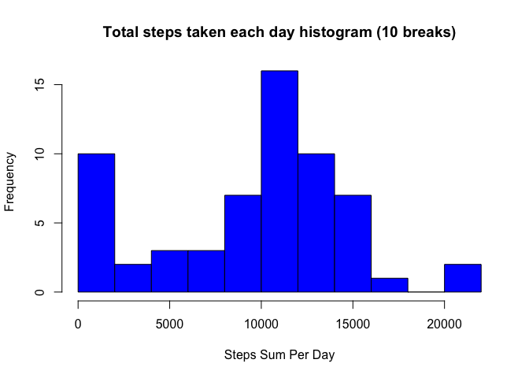
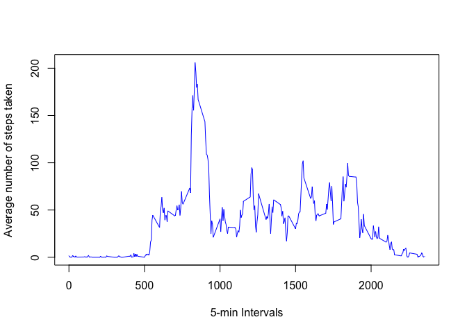
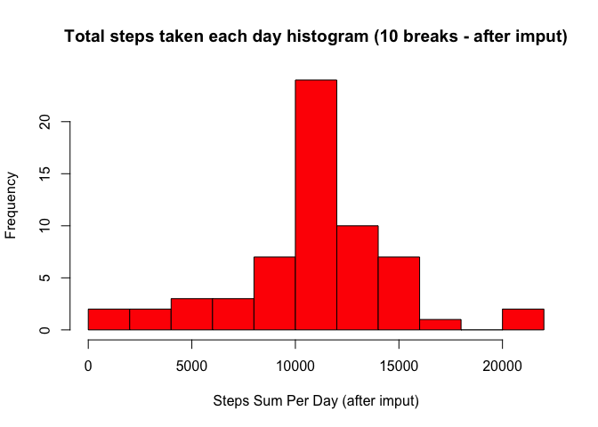
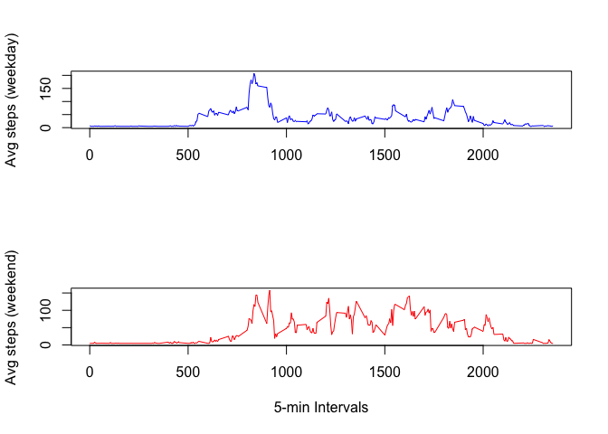

# Reproducible Research: Peer Assessment 1

*During the whole report I will print the first part of newly created datasets to indicate the nature of their contents. You can reproduce everything and in the length you desire if you execute the commands as they are displayed in this report. Thank you.*

## Loading and preprocessing the data

In order to read the data we first need to unzip the activity file and then use `read.csv` to load the data in a variable. Then, as we will use the dplyr library I make sure the library is loaded and the data are transformed in `tbl_df` format. Then, we `group_by` date so that we can easily calculate the next tasks.


```r
setwd("~/Desktop/Machine Learning/RepData_PeerAssessment1") # Set the working directory
unzip("activity.zip", exdir = "./") # Unzip data
data <- read.csv("activity.csv") # Read data
suppressPackageStartupMessages(library("dplyr")) # Nice library to handle data
dat <- tbl_df(data)
by_date <- group_by(dat, date)
```

## What is the sum/mean/median total number of steps taken per day?

In order to find sth like that we can use the `summarize` function and the simple sum/mean/median function:


```r
sum_step_per_day <- summarize(by_date, steps_sum = sum(steps, na.rm = TRUE))
print(sum_step_per_day)
```

```
## Source: local data frame [61 x 2]
## 
##          date steps_sum
## 1  2012-10-01         0
## 2  2012-10-02       126
## 3  2012-10-03     11352
## 4  2012-10-04     12116
## 5  2012-10-05     13294
## 6  2012-10-06     15420
## 7  2012-10-07     11015
## 8  2012-10-08         0
## 9  2012-10-09     12811
## 10 2012-10-10      9900
## ..        ...       ...
```

```r
mean_step_per_day <- summarize(by_date, steps_mean = mean(steps, na.rm = TRUE))
print(mean_step_per_day)
```

```
## Source: local data frame [61 x 2]
## 
##          date steps_mean
## 1  2012-10-01        NaN
## 2  2012-10-02    0.43750
## 3  2012-10-03   39.41667
## 4  2012-10-04   42.06944
## 5  2012-10-05   46.15972
## 6  2012-10-06   53.54167
## 7  2012-10-07   38.24653
## 8  2012-10-08        NaN
## 9  2012-10-09   44.48264
## 10 2012-10-10   34.37500
## ..        ...        ...
```

```r
median_step_per_day <- summarize(by_date, steps_median = median(steps, na.rm = TRUE))
print(median_step_per_day)
```

```
## Source: local data frame [61 x 2]
## 
##          date steps_median
## 1  2012-10-01           NA
## 2  2012-10-02            0
## 3  2012-10-03            0
## 4  2012-10-04            0
## 5  2012-10-05            0
## 6  2012-10-06            0
## 7  2012-10-07            0
## 8  2012-10-08           NA
## 9  2012-10-09            0
## 10 2012-10-10            0
## ..        ...          ...
```

Could you make a histogram of the total number of steps taken each day?


```r
hist(sum_step_per_day$steps_sum, main="Total steps taken each day histogram (10 breaks)", col = "blue1", xlab = "Steps Sum Per Day", breaks = 10)
```

 

## What is the average daily activity pattern?

In order to fins this we gotta group by interval this time and then summarize that finding the mean based on steps. Then the plot need the `type = "l"` parameter and we are done:


```r
by_interval <- group_by(dat, interval)
mean_steps_per_interval <- summarize(by_interval, steps_mean = mean(steps, na.rm = TRUE))
plot(steps_mean ~ interval, mean_steps_per_interval, type = "l", xlab = "5-min Intervals", ylab = "Average number of steps taken", col = "blue1")
```

 

It's obvious from the graph that the 5-min interval that has the most walking is 835, clearly seen by this command:


```r
mean_steps_per_interval$interval[which.max(mean_steps_per_interval$steps_mean)]
```

```
## [1] 835
```

## Imputing missing values

As you can see in the data, there are 2304 rows with NA values for the number of steps of that interval. This is checked easily by executing:


```r
sum(is.na(by_interval$steps))
```

```
## [1] 2304
```

In order to check how much those NAs affect our calculations, we will imput the missing values with 37.3825996, which is the average steps done in an interval. In order to do that we just have to introduce this value instead of the NAs and repeat the procedure:


```r
by_date_imput <- by_date
by_date_imput[is.na(by_date_imput)] <- summarize(dat, avg_steps = mean(steps, na.rm = TRUE))$avg_steps
sum_step_per_day_imput <- summarize(by_date_imput, steps_sum = sum(steps, na.rm = TRUE))
print(sum_step_per_day_imput)
```

```
## Source: local data frame [61 x 2]
## 
##          date steps_sum
## 1  2012-10-01  10766.19
## 2  2012-10-02    126.00
## 3  2012-10-03  11352.00
## 4  2012-10-04  12116.00
## 5  2012-10-05  13294.00
## 6  2012-10-06  15420.00
## 7  2012-10-07  11015.00
## 8  2012-10-08  10766.19
## 9  2012-10-09  12811.00
## 10 2012-10-10   9900.00
## ..        ...       ...
```

```r
mean_step_per_day_imput <- summarize(by_date_imput, steps_mean = mean(steps, na.rm = TRUE))
print(mean_step_per_day_imput)
```

```
## Source: local data frame [61 x 2]
## 
##          date steps_mean
## 1  2012-10-01   37.38260
## 2  2012-10-02    0.43750
## 3  2012-10-03   39.41667
## 4  2012-10-04   42.06944
## 5  2012-10-05   46.15972
## 6  2012-10-06   53.54167
## 7  2012-10-07   38.24653
## 8  2012-10-08   37.38260
## 9  2012-10-09   44.48264
## 10 2012-10-10   34.37500
## ..        ...        ...
```

```r
median_step_per_day_imput <- summarize(by_date_imput, steps_median = median(steps, na.rm = TRUE))
print(median_step_per_day_imput)
```

```
## Source: local data frame [61 x 2]
## 
##          date steps_median
## 1  2012-10-01      37.3826
## 2  2012-10-02       0.0000
## 3  2012-10-03       0.0000
## 4  2012-10-04       0.0000
## 5  2012-10-05       0.0000
## 6  2012-10-06       0.0000
## 7  2012-10-07       0.0000
## 8  2012-10-08      37.3826
## 9  2012-10-09       0.0000
## 10 2012-10-10       0.0000
## ..        ...          ...
```

```r
hist(sum_step_per_day_imput$steps_sum, main="Total steps taken each day histogram (10 breaks - after imput)", col = "red1", xlab = "Steps Sum Per Day (after imput)", breaks = 10)
```

 

By checking the reports above we can obviously see that depending on the approach we will decide to use on the imputation the numbers are affected (easily seen in the hist graph as well).

## Are there differences in activity patterns between weekdays and weekends?

In order to check this we have to muttate our data to have a new column called "day" that will take two values "Weekday" and "Weekend". Then, we will create one plot with the two graphs side by side to identify any potential differences.


```r
dat_imput <- dat
dat_imput[is.na(dat_imput)] <- summarize(dat, avg_steps = mean(steps, na.rm = TRUE))$avg_steps
dat_imput <- mutate(dat_imput, day = ifelse(weekdays( as.Date(dat_imput$date) ) %in% c("Saturday","Sunday"), "weekend", "weekday"))
weekday <- filter(dat_imput, day == "weekday")
weekend <- filter(dat_imput, day == "weekend")
weekday_by_interval <- group_by(weekday, interval)
weekend_by_interval <- group_by(weekend, interval)
mean_steps_per_interval_weekday <- summarize(weekday_by_interval, steps_mean = mean(steps, na.rm = TRUE))
print(mean_steps_per_interval_weekday)
```

```
## Source: local data frame [288 x 2]
## 
##    interval steps_mean
## 1         0   7.006569
## 2         5   5.384347
## 3        10   5.139902
## 4        15   5.162124
## 5        20   5.073235
## 6        25   6.295458
## 7        30   5.606569
## 8        35   6.006569
## 9        40   4.984347
## 10       45   6.584347
## ..      ...        ...
```

```r
mean_steps_per_interval_weekend <- summarize(weekend_by_interval, steps_mean = mean(steps, na.rm = TRUE))
print(mean_steps_per_interval_weekend)
```

```
## Source: local data frame [288 x 2]
## 
##    interval steps_mean
## 1         0   4.672825
## 2         5   4.672825
## 3        10   4.672825
## 4        15   4.672825
## 5        20   4.672825
## 6        25   7.922825
## 7        30   4.672825
## 8        35   4.672825
## 9        40   4.672825
## 10       45   5.047825
## ..      ...        ...
```

```r
par(mfrow=c(2,1))
plot(steps_mean ~ interval, mean_steps_per_interval_weekday, type = "l", xlab = "", ylab = "Avg steps (weekday)", col = "blue1")
plot(steps_mean ~ interval, mean_steps_per_interval_weekend, type = "l", xlab = "5-min Intervals", ylab = "Avg steps (weekend)", col = "red1")
```

 

Indeed, it's noticeable that early in the day it's much more possible to have multiple steps if it's a weekday (reasonable, as most people have to work) while in weekends it's possible they oversleep a little bit. The same logic is obvious later in the day for weekends where people tend to be much more active based on their steps' numbers, sth logical, as they tend to do their hobbies or go out for a walk/stroll during the afternoon of a weekend day.
